# AKS Monitoring with Azure Monitor and Grafana

## Project Overview

This project demonstrates how to **monitor an Azure Kubernetes Service
(AKS) cluster using Azure Monitor and Grafana**.

The monitoring pipeline includes:

-   **Azure Kubernetes Service (AKS)**
-   **Azure Log Analytics Workspace**
-   **Azure Monitor**
-   **Grafana deployed inside Kubernetes using Helm**
-   **Azure Monitor datasource connected to Grafana**

The result is a **complete observability dashboard** for the AKS cluster
showing:

-   CPU usage
-   Memory utilization
-   Node metrics
-   Pod metrics
-   Namespace usage
-   Disk and network metrics

This project simulates a **real DevOps monitoring workflow used in
production environments**.

------------------------------------------------------------------------

# Architecture

The monitoring architecture works as follows:

AKS Cluster → Azure Monitor Add-on → Log Analytics Workspace → Grafana →
Dashboards

Azure Monitor collects metrics from the AKS cluster and stores them in
**Log Analytics Workspace**.\
Grafana queries these metrics through **Azure Monitor API** and
visualizes them in dashboards.

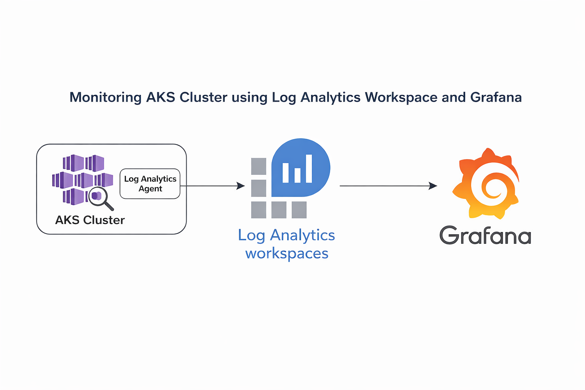
------------------------------------------------------------------------

# Technologies Used

-   **Azure Kubernetes Service (AKS)** -- Managed Kubernetes service on
    Azure
-   **Azure Monitor** -- Azure native monitoring service
-   **Log Analytics Workspace** -- Storage for logs and metrics
-   **Grafana** -- Visualization and monitoring dashboard tool
-   **Helm** -- Kubernetes package manager
-   **kubectl** -- Kubernetes command line tool
-   **Azure CLI** -- Command line interface for Azure

------------------------------------------------------------------------

# What is Azure Log Analytics Workspace?

Azure Log Analytics workspace is a **central storage location for logs
and monitoring data** collected by Azure Monitor.

It collects logs from different Azure resources such as:

-   Virtual Machines
-   Azure Kubernetes Service
-   Azure App Services
-   Containers

You can think of the workspace as a **database that stores monitoring
metrics and logs** which can later be queried and visualized.

------------------------------------------------------------------------

# What is Grafana?

Grafana is an **open-source analytics and visualization platform**.

It allows users to:

-   Query metrics from different data sources
-   Build monitoring dashboards
-   Visualize system metrics
-   Set alerts
-   Monitor infrastructure in real time

In this project Grafana connects to **Azure Monitor** to visualize AKS
metrics.

------------------------------------------------------------------------

# Prerequisites

Before starting ensure the following:

-   Azure Subscription
-   Azure CLI installed
-   kubectl installed
-   Helm installed

Check versions:

``` bash
az version
helm version
```

Example:

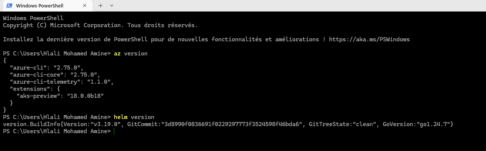

------------------------------------------------------------------------

# Step 1 --- Create Resource Group

A resource group is a container that holds all Azure resources for this
project.

``` bash
az group create --name rg-aks-monitoring --location westeurope
```

Example output:

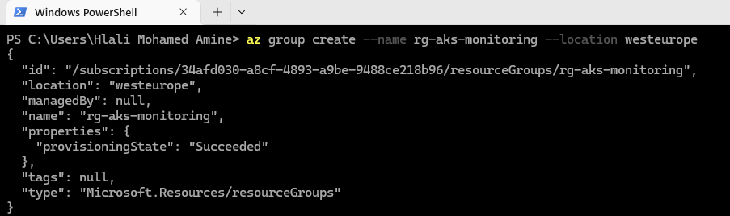

------------------------------------------------------------------------

# Step 2 --- Create Log Analytics Workspace

Create a Log Analytics workspace to store monitoring logs.

``` bash
az monitor log-analytics workspace create --resource-group rg-aks-monitoring --workspace-name law-aks-monitoring --location westeurope
```

Example result:

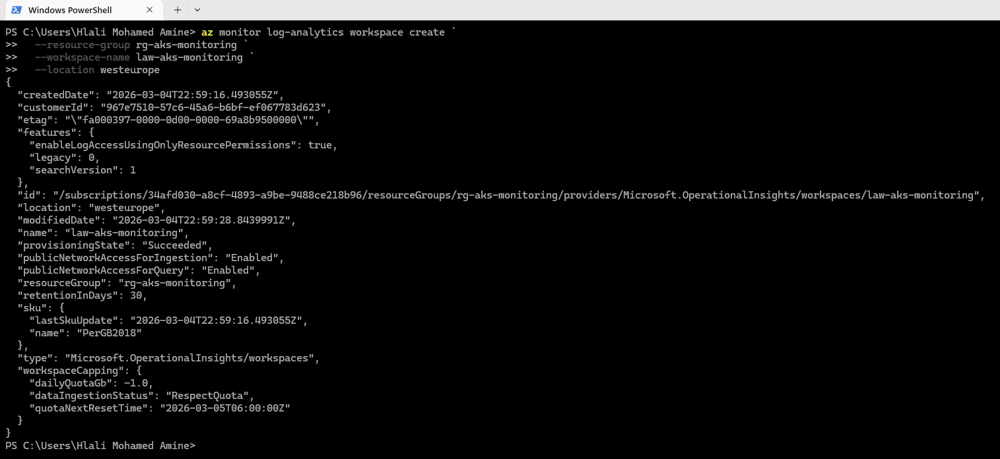

------------------------------------------------------------------------

# Step 3 --- Get Workspace Customer ID

Retrieve the workspace ID which will be used by Azure Monitor.

``` bash
az monitor log-analytics workspace show --resource-group rg-aks-monitoring --workspace-name law-aks-monitoring --query customerId -o tsv
```

Example:

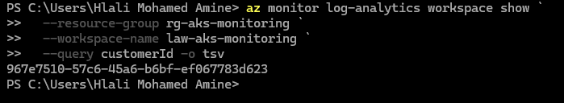

------------------------------------------------------------------------

# Step 4 --- Create AKS Cluster

Create an AKS cluster and enable the **Azure Monitor add-on**.

``` bash
az aks create --resource-group rg-aks-monitoring --name aks-monitoring-demo --location westeurope --node-count 1 --enable-addons monitoring --workspace-resource-id <workspace_id> --generate-ssh-keys
```

Example deployment:

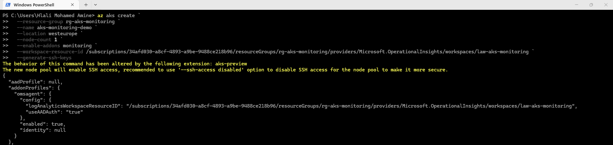

------------------------------------------------------------------------

# Step 5 --- Verify AKS in Azure Portal

After deployment the cluster should appear in Azure Portal.

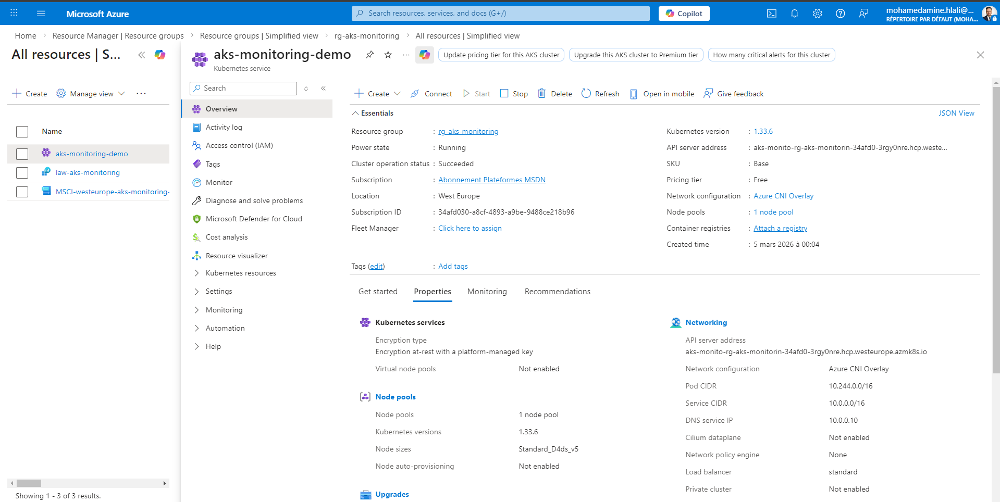

------------------------------------------------------------------------

# Step 6 --- Connect to AKS Cluster

Download Kubernetes credentials and connect to the cluster.

``` bash
az aks get-credentials --resource-group rg-aks-monitoring --name aks-monitoring-demo
```

Verify nodes:

``` bash
kubectl get nodes
```

Example:

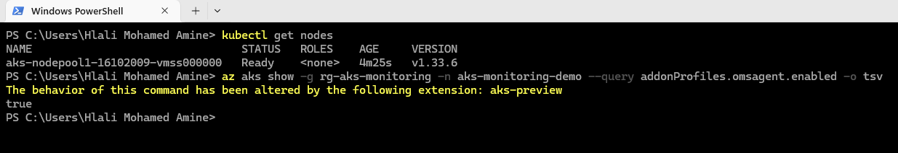

------------------------------------------------------------------------

# Step 7 --- Verify Monitoring Add-on

Ensure Azure Monitor is enabled.

``` bash
az aks show -g rg-aks-monitoring -n aks-monitoring-demo --query addonProfiles.omsagent.enabled -o tsv
```

Expected output:

    true

Example:


------------------------------------------------------------------------

# Step 8 --- Install Grafana using Helm

Add Grafana Helm repository.

``` bash
helm repo add grafana https://grafana.github.io/helm-charts
helm repo update
```

Example:

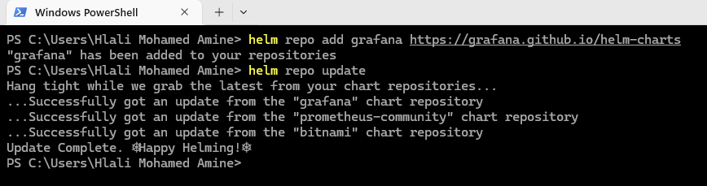

------------------------------------------------------------------------

# Step 9 --- Create Monitoring Namespace

Create a Kubernetes namespace for monitoring tools.

``` bash
kubectl create namespace monitoring
kubectl get ns
```

Example:

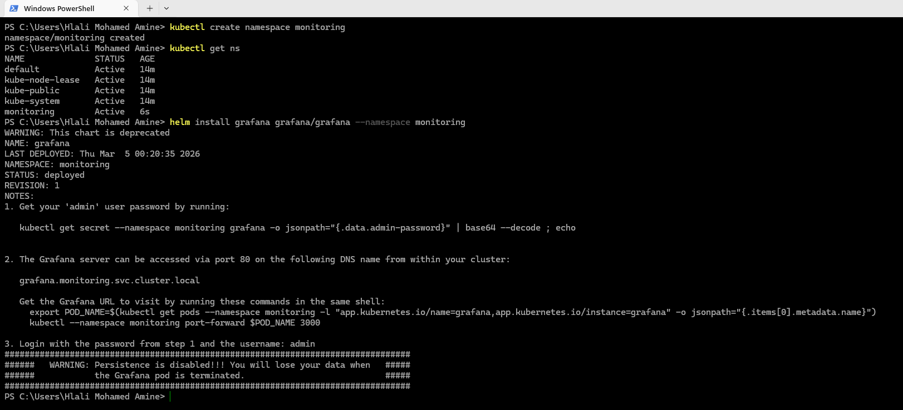

------------------------------------------------------------------------

# Step 10 --- Install Grafana

Deploy Grafana using Helm.

``` bash
helm install grafana grafana/grafana --namespace monitoring
```

Example:


------------------------------------------------------------------------

# Step 11 --- Retrieve Grafana Password

Retrieve the admin password from Kubernetes secret.

``` bash
kubectl get secret grafana -n monitoring -o jsonpath="{.data.admin-password}"
```

Decode Base64 password.

Example:

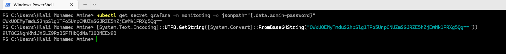

------------------------------------------------------------------------

# Step 12 --- Access Grafana

Expose Grafana locally.

``` bash
kubectl port-forward -n monitoring svc/grafana 3000:80
```

Open browser:

    http://localhost:3000

Example:

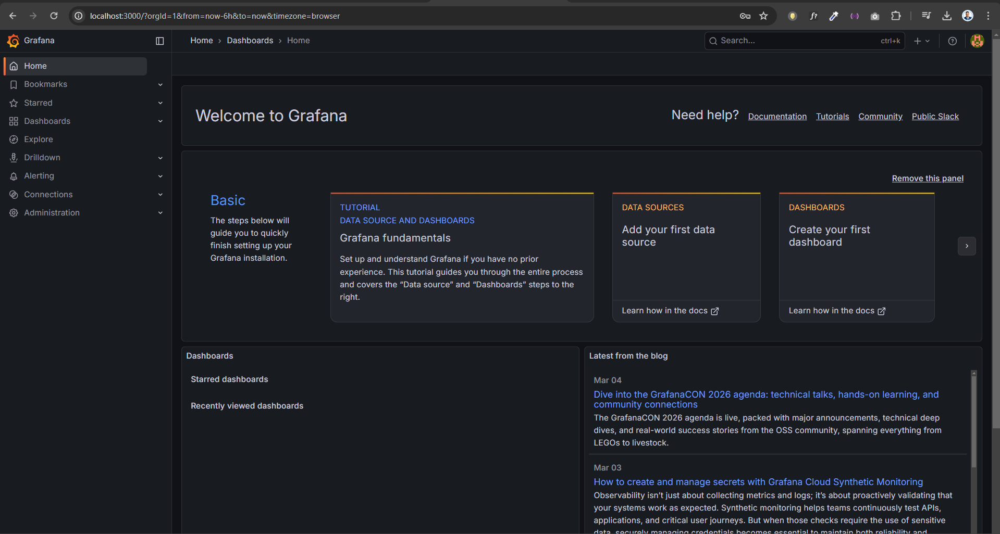

------------------------------------------------------------------------

# Step 13 --- Create Azure Service Principal

Create a service principal for Grafana authentication.

``` bash
az ad sp create-for-rbac --name grafana-monitoring --role Reader --scopes /subscriptions/<subscription_id>
```

Example:

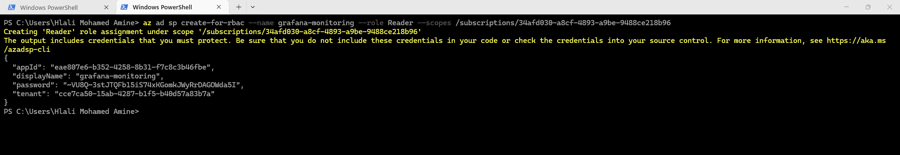

------------------------------------------------------------------------

# Step 14 --- Configure Azure Monitor Datasource

In Grafana go to:

Connections → Data Sources → Azure Monitor

Enter:

-   Tenant ID
-   Client ID
-   Client Secret


Successful connection:

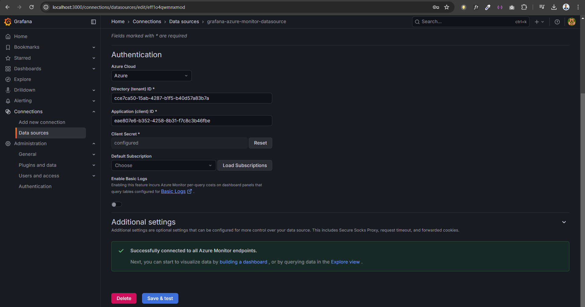

------------------------------------------------------------------------

# Step 15 --- Import Grafana Dashboard

Import the Azure Monitor dashboard.

Dashboard ID:

    10956

Example:

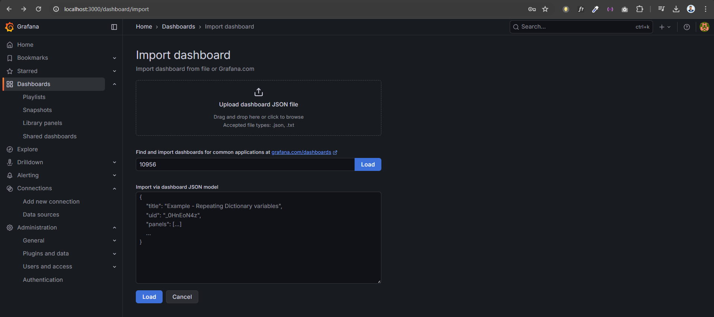

------------------------------------------------------------------------

# View AKS Monitoring Dashboard

Once imported, Grafana displays metrics including:

-   CPU utilization
-   Memory usage
-   Node metrics
-   Pod statistics
-   Namespace metrics
-   Disk and network metrics

Example dashboard:

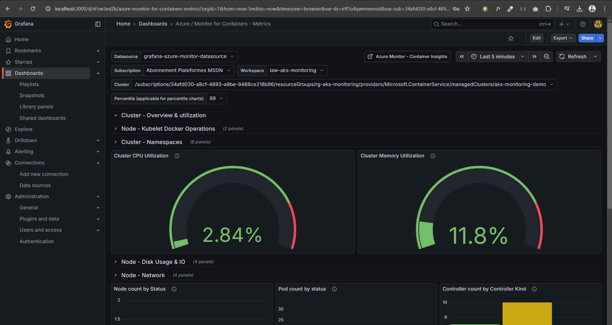
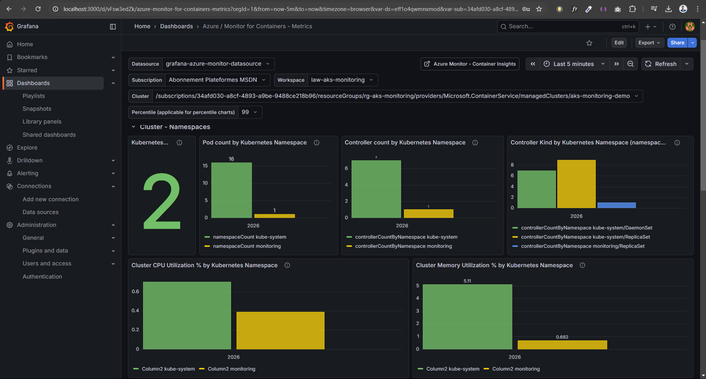

------------------------------------------------------------------------

# Cleanup Resources

To avoid Azure charges delete the resource group.

``` bash
az group delete --name rg-aks-monitoring --yes --no-wait
```


## 👨‍💻 Author

**Mohamed Amine Hlali**

🚀 Azure DevOps & Cloud Engineer  

🔗 LinkedIn:  
https://www.linkedin.com/in/mohamed-amine-hlali

💡 Passionate about:

- Azure Cloud
- Kubernetes (AKS)
- DevOps & CI/CD
- Infrastructure as Code
- Cloud Monitoring & Observability


### 🌐 Connect with me

https://www.mohamedaminehlali.cloud

⭐ If you found this project useful, feel free to star the repository.